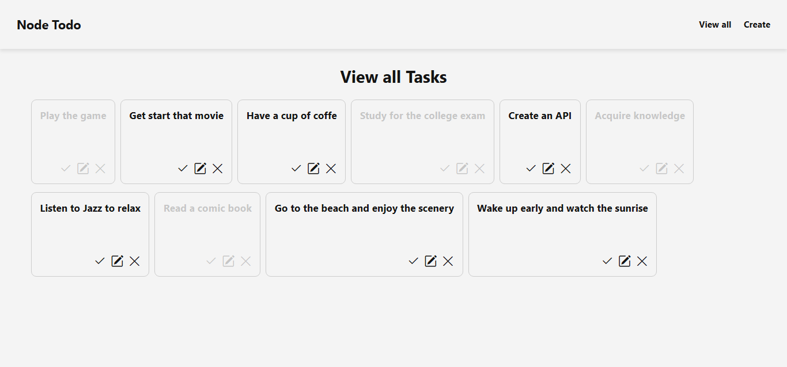
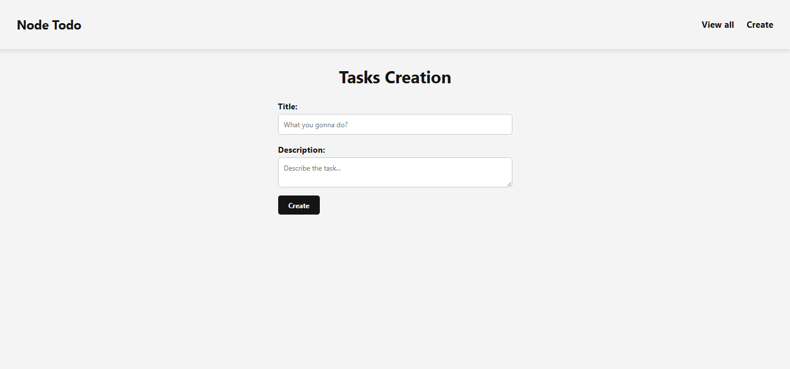
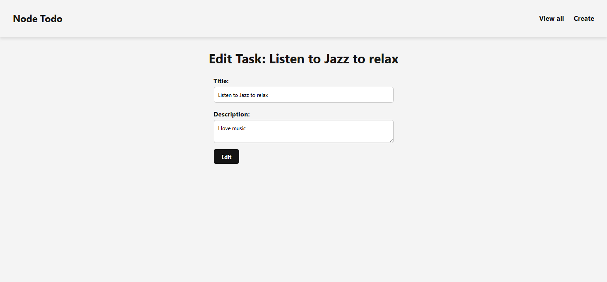

# ✅ To-Do List Application with Node.js, Express, Handlebars, MySQL & Sequelize

To-Do List Application with **Node.js**, **Express**, **Handlebars** **MySQL** & **Sequelize ORM**

## 🚀 Features

- Create, view, edit, and delete tasks  
- Mark and unmark tasks as completed  
- Page rendering using **Express-Handlebars**  
- Organized following the **MVC** architecture  
- Form validation and handling  
- Integration with a relational database via **Sequelize**

## 🛠️ Technologies Used

- **Node.js**
- **Express.js**
- **Sequelize**
- **MySQL**
- **Express-Handlebars**

## 📦 Installation

To run the project locally, follow the steps below:

### 1. Clone the repository
    git clone https://github.com/GuillhermeHenrique/todo_list_node
    cd your-repo-name

### 2. Install dependencies
    npm install

### 3. Create a <code>.env</code> file

Configure your database connection:

    DB_NAME=your_database_name
    DB_USER=your_username
    DB_PASSWORD=your_password
    DB_HOST=your_localhost
    DIALECT=mysql

### 4. Start the server
    npm start

### 5. Visit the app

Navigate to <code>http://localhost:3000/tasks</code> in your browser.

## 📸 Screenshots

Below are some screenshots of the system in action:

### ✅ Task List

### ➕ New Task Form

### ✏️ Edit Task

   

## 📌 Routes Overview

| Método | Rota                 | Descrição                       |
|--------|----------------------|---------------------------------|
| GET    | /tasks/              | Lists all tasks                 |
| GET    | /tasks/add           | Shows the create task form      |
| POST   | /tasks/add           | Saves a new task                |
| GET    | /tasks/edit/:id      | 	Shows the edit task form      |
| POST   | /tasks/edit          | 	Updates an existing task      |
| POST   | /tasks/remove        | 	Removes a task                |
| POST   | /tasks/updatestatus  | Toggles task completion status  |

## 👨‍💻 Author

Developed by Guilherme Henrique (GitHub: GuillhermeHenrique, Email: guilhermecafe1010@gmail.com)
